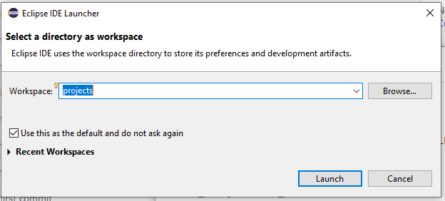

# Java Flight Recorder / Java Mission Control Demonstrations


## Index
  - [Index](#index)
  - [Introduction](#introduction)
  - [Sample videos](#sample-videos)
  - [Installation Steps](#install)
  - [A few files of note](#a-few-files-of-note)

<a id="markdown-introduction" name="introduction"></a>
## Introduction
  
This repository was cloned from Markus Hirt's github repository at [https://github.com/thegreystone/jmc-tutorial](https://github.com/thegreystone/jmc-tutorial)

Among the modifications made, this repository should be entirely self-contained. It includes a JDK 17 instance, a copy of Java Mission Control 8.1 and a copy of Eclipse 4.22.0 with the Java Mission Control 8.1 plugin.  Ideally, users should be able to clone this repository and run within the demo environment without having to do much in the way of configuration, once the [installation](#install) step is completed.

Adimittedly this is only Windows based, but could be enhanced to work in both MacOS and Linux environments with a little work.

It contains [sample videos](#sample-videos) of some of the projects contained in the orignal tutorial.

<a id="markdown-sample-videos" name="samplevideos"></a>
## Sample videos

The following videos are available for viewing in the *media/* directory.  They are roughly based on the firist sections of the [JMC_Tutorial.pdf](JMC_Tutorial.pdf) document found in this repository.  Each demo recording is prefaced with a number {1,2,3,4} as means to recommend what order (not mandatory) they should be viewed.   They start with a brief introduction describing the demo and the feature to be highlighted, followed by the actual demonstration itself.

- **[1_HotMethods-demo.mp4](media/1_HotMethods-demo.mp4)**: *12m 53s* – demonstrates how method profiling can be used to identify the most frequently run code paths; an important tool used to improve application throughput and performance.

- **[2_Latencies-demo.mp4](media/2_Latencies-demo.mp4)**: *8m 18s* – demonstrates how a latency can be identified in a sample problematic program with JFR/JMC, and a possible solution to the problem

- **[3_Triggers-demo.mp4](media/3_Triggers-demo.mp4)**: *10m 10s* – Triggers are a feature in JMC enabling developers to perform actions, real-time, based on conditions they can set

- **[4_GC-demo.mp4](media/4_GC-demo.mp4)**: *10m 37s* – Shows how to get a detailed information about a program’s garbage collection activity

<a id="markdown-a-few-files-of-note" name="a-fw-files-of-note"></a>
## Installation Steps

1. To unpack and install JDK 17, JMC 8.1 and Eclipse 4.22.0, run the ```install.bat``` Windows batch file from the root directory of this repository.
2. Start Eclipse by running the ```startEclipse.bat``` Windows batch file
3. At startup, you'll be presented with a window to select a workspace directory.  Choose the projects/ directory found in this repository and mark the checkbox "Use this as a default and do not ask again".  A screenshot follows:
   
   
4. Install the Java Mission Control plugin to eclipse by following the steps in this [link](https://download.oracle.com/technology/products/missioncontrol/updatesites/oracle/8.1.0/ide/update-site-instructions/index.html)


<a id="markdown-install" name="install"></a>
## A Few Files of Note

To unpack and install JDK 17, JMC 8.1 and Eclipse 4.22.0, run the ```install.bat``` script from the root directory of this repository.

[setenv.bat](setenv.bat) - sets the JAVA_HOME and PATH to the local JDK directory

[reset-env.bat](reset-env.bat) - As part of the tutorial or demonstration, source code can be modified to see how program behavior changes. This batch file resets the demo environment to its original state for the the following Eclipse projects found in the *projects/* directory:
- 02_JFR_HotMethods
- 03_JFR_Latencies
- 03a_JFR_Latencies_manual
- 04_JFR_GC

[startEclipse.bat](startEclipse.bat) - batch file to start the Eclipse IDE (with the Mission Control plugin)

[startJMC.bat](startJMC.bat) - batch file to start a standalone version of Java Mission Control

[README-original.md](README-original.md) - Original README.md that was part of this repository